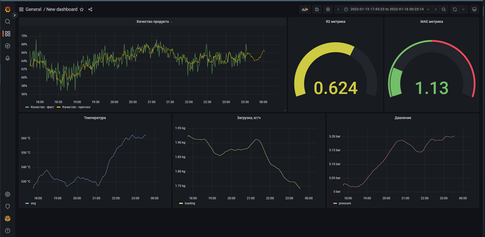

## Симуляция работы ML-модели на "исторических" данных
### Ссылка на Хабр: https://habr.com/ru/company/nornickel/blog/689484/

В директории "Python":

* `simple_ML_model.ipynb` - ноутбук с кодом обучения модели и подготовки данных для симуляции
* `model_emulation.py` - скрипт для загрузки данных в БД
* `data/dataset.csv` - исходные данные для обучения модели
* `data/df_emulation.csv` - подготовленные данные для симуляции

В директории 'Grafana':
* `dashboard.json` - json файл с конфигурацией дашборда на Grafana.

